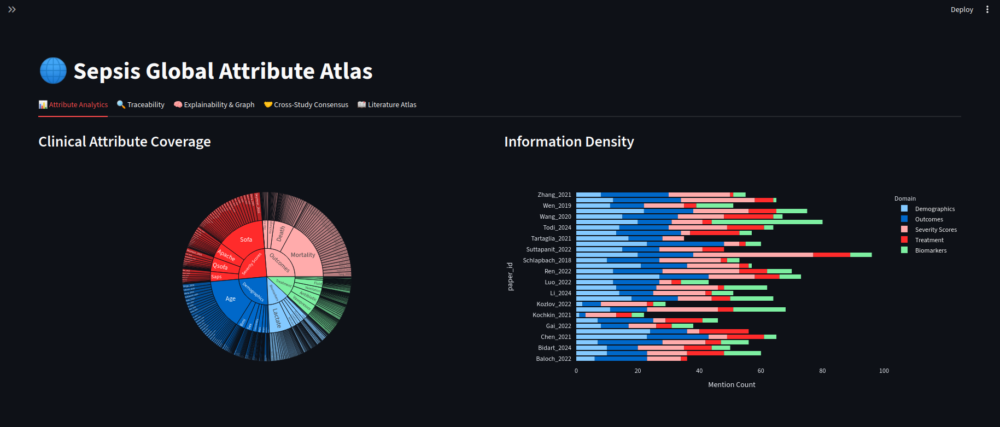

# Sepsis Atlas — Ingest Pipeline

PDF ingestion, table repair, and structured export pipeline for clinical sepsis papers.

## Project Structure

```
HACKATHON/
├── papers/                     # input PDFs
├── data/
│   └── parsed_papers/          # auto-created cache
│       ├── {paper_id}.json         # docling full parse cache (never overwritten)
│       ├── {paper_id}.md           # sections text only (no tables)
│       └── {paper_id}_tables.json  # tables, overwritten on manual rotation
├── ingest.py                   # PDF → ParsedPaper (sections + tables + page numbers)
├── extract.py                  # ParsedPaper → PaperExtractions via LLM
├── schemas.py                  # Pydantic models for extraction
├── pipeline.py                 # end-to-end run script
└── test_ingest.py              # Streamlit ingest viewer UI
```

## Setup

### 1. Clone and install dependencies

```bash
git clone <your-repo-url>
cd HACKATHON
pip install -r requirements.txt
```


Core dependencies:

| Library | Purpose |
|---|---|
| `docling` | Layout-aware PDF parsing, table structure extraction |
| `streamlit` | Ingest viewer UI |
| `pandas` | Table display and manipulation |
| `pyarrow` | Streamlit dataframe backend |
| `pymupdf` | Page-to-image rendering (table repair fallback) |
| `openai` | OpenRouter API client |
| `instructor` | Structured LLM output via Pydantic |
| `pydantic` | Schema validation |


```

## Usage

### Ingest Viewer (Streamlit UI)

```bash
streamlit run test_ingest.py
```

Features:
- Select any PDF from `papers/`
- Browse parsed sections with page numbers
- View all tables — rotated tables auto-flagged 🔴
- Cycle transpose mode (`original → down → up`) — saves to `_tables.json` automatically on rotate
- Sections tab capped at 2000 chars for readability; tables shown in full with horizontal scroll


## Caching

All parsed papers are cached in `data/parsed_papers/`. Re-running on the same PDF uses the cache — no re-parsing.

To force re-parse:
```bash
rm data/parsed_papers/{paper_id}.json
```

To reset a rotated table fix:
```bash
rm data/parsed_papers/{paper_id}_tables.json
```

## File Format Details

## Methods and Files

`tablejsonviewer.py` Interactive view of markdown and json (non networkX) files. Gives best visualisation and analysis with `./data/parsed_papers`

`graph_viewer.py` Interactive view of json files stored in networkx format in streamlit

`dashboard_viewer_graph.py` Sepsis Global Attribute Atlas


### `{paper_id}.md`

Sections text only. No tables. Used for text chunking and LLM context.

```markdown
## Abstract
Sepsis is defined as life-threatening organ dysfunction...

## Methods
...
```

### `{paper_id}_tables.json`

List of table objects. Overwritten when you rotate a table in the UI.

```json
[
  {
    "index": 0,
    "preceding_heading": "Results",
    "markdown": "| Variable | EGDT | Usual Care |\n|---|---|---|\n...",
    "page_start": 4
  }
]
```

### Use Case 1: Mortality Counterfactuals

`schemas_usecase.py` and `extract_usecase.py` to extract the jsons and store them under `data/mortality_counterfactuals`

`visualize_usecase.py` to streamlit visualize the jsons with traceability.

## Known Limitations

- Docling does not handle rotated tables automatically — use the `↕` button in the viewer
- Figures are not extracted (no image content, only captions if adjacent to text)
- Superscripts and subscripts are flattened to plain text

## LLM Extraction

Extraction uses a local Ollama model by default (`llama3.2`). To switch to a cloud model via OpenRouter, update `extract.py`:

```python
client = instructor.from_openai(
    OpenAI(
        base_url="https://openrouter.ai/api/v1",
        api_key=os.environ["OPENROUTER_API_KEY"],
    ),
    mode=instructor.Mode.JSON,
)
LOCAL_MODEL = "openai/gpt-4o-mini"  # or "google/gemma-3-27b-it"
```
