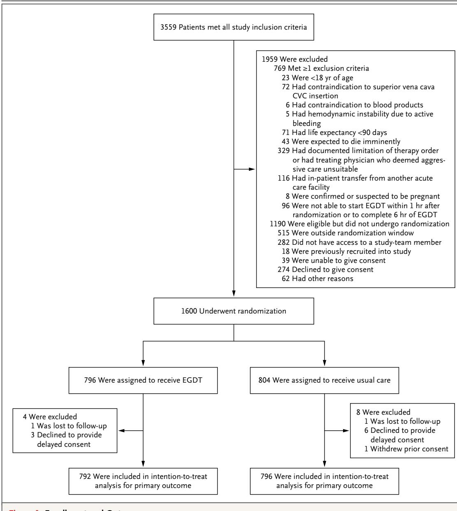
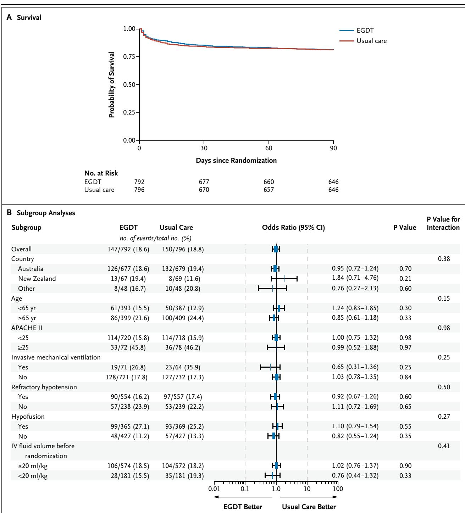

# Goal-Directed Resuscitation for Patients with Early Septic Shock

The ARISE Investigators and the ANZICS Clinical Trials Group\*

# ABSTRACT

The members of the writing committee (Sandra L.Pake, M.D., Ph.D., Anthony Delaney, M.D., Ph.D., Michael Bailey, Ph.D., Rinaldo Bellomo, M.D., Peter A. Cameron, M.D., D. James Cooper, M.D., Alisa M. Higgins, M.P.H., Anna Holdgate, M.D., Belinda D. Howe, M.P.H., Steven A.R. Webb, M.D., Ph.D., and Patricia Williams, B.N.) assume responsibility for the overall content and integrity of the article. Address reprint requests to Ms. Belinda Howe at the Australian and New Zealand Intensive Care Research Centre, Alfred Centre, Level 6 (Lobby B), 99 Commercial Rd., Melbourne, VIC 3004, Australia, or at anzicrc@monash.edu.

\*The Australasian Resuscitation in Sepsis Evaluation (ARISE) study is a collaboration of the Australian and New Zealand Intensive Care Society (ANZICS) Clinical Trials Group, the Australasian College for Emergency Medicine, and the Australian and New Zealand Intensive Care Research Centre. The affiliations of the writing committee members are listed in the Appendix. A complete list of investigators in the ARISE study is provided in the Supplementary Appendix, available at NEM.org.

# BACKGROUND

Early goal-directed therapy (EGDT) has been endorsed in the guidelines of the Surviving Sepsis Campaign as a key strategy to decrease mortality among patients presenting to the emergency department with septic shock. However, its effectiveness is uncertain.

# METHODS

In this trial conducted at 51 centers (mostly in Australia or New Zealand), we randomly assigned patients presenting to the emergency department with early septic shock to receive either EGDT or usual care. The primary outcome was all-cause mortality within 90 days after randomization.

# RESULTS

Of the 1600 enrolled patients, 796 were assigned to the EGDT group and 804 to the usual-care group. Primary outcome data were available for more than $9 9 \%$ of the patients. Patients in the EGDT group received a larger mean $( \pm \mathrm { S D } )$ volume of intravenous fluids in the first 6 hours after randomization than did those in the usualcare group $( 1 9 6 4 \pm 1 4 1 5 \ \mathrm { m l }$ vs. $1 7 1 3 { \pm } 1 4 0 1 \ \mathrm { m l } $ and were more likely to receive vasopressor infusions $( 6 6 . 6 \%$ vs. $5 7 . 8 \%$ , red-cell transfusions $( 1 3 . 6 \%$ vs. $7 . 0 \%$ , and dobutamine $1 5 . 4 \%$ vs. $2 . 6 \%$ $\mathrm { P } { < } 0 . 0 0 1$ for all comparisons). At 90 days after randomization, 147 deaths had occurred in the EGDT group and 150 had occurred in the usual-care group, for rates of death of $1 8 . 6 \%$ and $1 8 . 8 \%$ , respectively (absolute risk difference with EGDT vs. usual care, $- 0 . 3$ percentage points; $9 5 \%$ confidence interval, $- 4 . 1$ to 3.6; $\mathrm { P = } 0 . 9 0$ ). There was no significant difference in survival time, in-hospital mortality, duration of organ support, or length of hospital stay.

# CONCLUSIONS

In critically ill patients presenting to the emergency department with early septic shock, EGDT did not reduce all-cause mortality at 90 days. (Funded by the National Health and Medical Research Council of Australia and the Alfred Foundation; ARISE ClinicalTrials.gov number, NCT00975793.)

# METHODS

SEVR SESASARPO ANA. mortality from sepsis in recent years,4 the risk of death remains high.5,6 The fundamental principles for the management of sepsis include early recognition, control of the source of infection, appropriate and timely administration of antimicrobial drugs, and resuscitation with intravenous fluids and vasoactive drugs.

Patients presenting to the emergency department account for a large proportion of patients with severe sepsis. Reported in-hospital mortality ranges in this subgroup from 20 to $5 0 \%$ 3,8-10 In 2001, a proof-of-concept, randomized trial showed that early hemodynamic resuscitation according to a specific protocol termed early goal-directed therapy (EGDT) improved outcomes in patients presenting to the emergency department with severe sepsis, as compared with usual therapy.11

EGDT was subsequently incorporated into the 6-hour resuscitation bundle of the Surviving Sepsis Campaign guidelines,12-14 and a number of nonrandomized studies showed a survival benefit with bundle-based care that included EGDT.15-18 Despite such successes, considerable controversy has surrounded the role of EGDT in the treatment of patients with severe sepsis. Concerns have included the potential risks associated with individual elements of the protocol,19,20 uncertainty about the external validity of the original trial, and the infrastructure and resource requirements for implementing EGDT.21,22

In a randomized trial conducted in 31 academic centers in the United States (Protocolized Care for Early Septic Shock [ProCESS]),1º protocolbased resuscitation (a combination of EGDT and protocol-based standard therapy) was not associated with a survival benefit, as compared with usual care that was not protocol-based. Whether these results would hold up outside the United States and across a variety of academic and nonacademic health care settings is unknown; more evidence is needed to provide clinical direction.²3

We designed the multicenter Australasian Resuscitation in Sepsis Evaluation (ARISE) study to test the hypothesis that EGDT, as compared with usual care, would decrease 90-day all-cause mortality among patients presenting to the emergency department with early septic shock in diverse health care settings.

# STUDY DESIGN AND OVERSIGHT

From October 5, 2008, to April 23, 2014, we conducted this prospective, randomized, parallelgroup trial in 51 tertiary care and nontertiary care metropolitan and rural hospitals. Most centers were in Australia or New Zealand, with 6 centers in Finland, Hong Kong, and the Republic of Ireland (Table S1 in the Supplementary Appendix, available with the full text of this article at NEJM.org).24 Participating institutions did not have sepsis-resuscitation protocols at the time of site selection, and usual care did not include resuscitation guided by measurement of the central venous oxygen saturation $( \mathsf { S c v o } _ { 2 } )$ .25 The ARISE study was one of three collaborative, harmonized studies, along with the ProCESS trial10 and the Protocolized Management in Sepsis (ProMISe) trial (Current Controlled Trials number, ISRCTN36307479), designed to address the effectiveness of EGDT.24

The study protocol was approved by the ethics committee at Monash University, which was the coordinating center, and at each participating institution. The protocol and statistical analysis plan are available at NEJM.org. Prior informed written consent or delayed consent was obtained from all patients or their legal surrogates. The trial was overseen by an independent data and safety monitoring committee. ${ \mathsf { S c v O } } _ { 2 }$ monitors were loaned to participating sites by Edwards Lifesciences, which had no other role in the conduct of the study.

# STUDY POPULATION

Patients 18 years of age or older who met the eligibility criteria within 6 hours after presentation to the emergency department were assessed for enrollment. Eligibility criteria were a suspected or confirmed infection, two or more criteria for a systemic inflammatory response²6 (see the Methods section in the Supplementary Appendix), and evidence of refractory hypotension or hypoperfusion. Refractory hypotension was defined as a systolic blood pressure of less than ${ 9 0 } \mathrm { m m } \mathrm { H g }$ or a mean arterial pressure of less than $6 5 \mathrm { m m H g }$ after an intravenous fluid challenge of $1 0 0 0 ~ \mathrm { m l }$ or more administered within a 60-minute period. Hypoperfusion was defined as a blood lactate level of $4 . 0 \ \mathrm { m m o l }$ per liter or more. Randomization was required within 2 hours after fulfillment of the final inclusion criterion. The initiation of the first dose of intravenous antimicrobial therapy was mandated before randomization. The study exclusion criteria are provided in the Methods section in the Supplementary Appendix.

# RANDOMIZATION

Eligible patients were randomly assigned in a 1:1 ratio to receive either EGDT or usual care for 6 hours. Randomization was stratified according to study center with the use of a permutedblock method and was performed by means of a centralized telephone interactive voice-response system that was accessible 24 hours a day. Because of the nature of the intervention, all patients and clinicians involved in their care were aware of study-group assignments.

# STUDY TREATMENTS

For patients in the usual-care group, decisions about the location of care delivery, investigations, monitoring, and all treatments were made by the treating clinical team. $\mathsf { S c v o } _ { 2 }$ measurement was not permitted during the 6-hour intervention period. Data were collected regarding insertion of invasive monitoring devices, intravenous-fluid resuscitation, vasoactive support, red-cell transfusion, mechanical ventilation, and other supportive therapy.

For patients in the EGDT group, the intervention was provided by a study team trained in EGDT delivery. Both the care providers and location of delivery were dependent on local resources. Thus, investigators used EGDT implementation models based in the emergency department, the intensive care unit (ICU), or both. A multifaceted intervention was used to standardize EGDT delivery across sites.²4 Details of EGDT implementation, personnel, and location are provided in Table S1 and Figure S1 in the Supplementary Appendix.

In the EGDT group, an arterial catheter and a central venous catheter capable of continuous ${ \mathsf { S c v O } } _ { 2 }$ measurement (Edwards Lifesciences) were inserted within 1 hour after randomization. The resuscitation algorithm was based on the original EGDT algorithm11 and was followed until 6 hours after randomization (Fig. S1 in the Supplementary Appendix).

# STUDY OUTCOMES

The primary study outcome was death from any cause within 90 days after randomization. Secondary and tertiary outcomes included survival time from randomization to 90 days; mortality in the ICU; mortality at 28 days; in-hospital mortality at 60 days; cause-specific mortality at 90 days²7; length of stay in the emergency department, ICU, or elsewhere in the hospital; receipt and duration of mechanical ventilation, vasopressor support, or renal-replacement therapy; destination at the time of discharge (for surviving inpatients); limitation of therapy (e.g., do-not-resuscitate order) at the time of death (for nonsurvivors); and adverse events.

# STATISTICAL ANALYSIS

All analyses were conducted according to a statistical analysis plan that was reported previously.28 The sample-size calculation was based on an assumed in-hospital rate of death in the usual-care group of $2 8 \%$ ,25,29 with an increment of 10 percentage points $( 3 8 \% )$ for the rate of death at 90 days.8,30 Thus, an enrollment of 1600 patients would have a power of 85 to $9 0 \%$ (at a two-sided alpha level of 0.05) to detect an absolute risk reduction of 7.6 percentage points (or a relative risk reduction of $2 0 \%$ in the EGDT group, with allowance for a plausible range of loss to follow-up. One interim analysis was planned and performed after the enrollment of $5 0 \%$ of the patients, with the use of a two-sided, symmetric O'Brien-Fleming design and a two-sided P value of 0.005; this analysis was reviewed by the independent data and safety monitoring committee.

All analyses were conducted according to the intention-to-treat principle. No assumptions were made for missing or unavailable data. We report continuous variables as means $\mathrm { ( \pm S D ) }$ or medians and interquartile ranges, and categorical variables as proportions. We used Student's t-test or the Wilcoxon rank-sum test to analyze between-group differences, as appropriate. Fisher's exact test was used for categorical variables, including the primary outcome. Absolute and relative risk differences with $9 5 \%$ confidence intervals for all-cause mortality at 90 days are reported. Additional sensitivity analyses were performed with the use of multivariable logistic regression adjusted for predefined baseline covariates: country, age, score on the Acute Physiology and Chronic Health

Evaluation II (APACHE II), systolic blood pressure $( < 9 0 \ \mathrm { m m } \ \mathrm { H g }$ or $\geq 9 0 \ \mathrm { m m } \ \mathrm { H g } )$ , and presence or absence of invasive mechanical ventilation. We used the Kaplan-Meier method to calculate survival time from randomization to 90 days and the log-rank test to perform between-group comparisons. We used Cox proportional-hazards models adjusted for the previously specified baseline covariates to calculate hazard ratios with $9 5 \%$ confidence intervals. Values for length of hospital stay and duration of organ support were logtransformed and analyzed with the use of linear regression and are reported as ratios with $9 5 \%$ confidence intervals.

We conducted subgroup analyses for the primary outcome for predefined variables: country, age $_ { < 6 5 }$ years or ${ \ge } 6 5$ years), APACHE II score $_ { < 2 5 }$ or ${ \ge } 2 5 $ ), presence or absence of invasive mechanical ventilation, presence or absence or refractory hypotension, lactate level $\left( < 4 . 0 \ \mathrm { \ m m o l } \right.$ per liter or $\ge 4 . 0 \ \mathrm { m m o l }$ per liter), and intravenous fluid administration $\left( < 2 0 \mathrm { m l } \right.$ per kilogram of body weight or $\geq 2 0 ~ \mathrm { m l }$ per kilogram). Subgroup analyses were performed with the use of logistic regression, with heterogeneity determined on the basis of interaction between treatment and subgroup. Odds ratios with $9 5 \%$ confidence intervals for death at 90 days are presented in a forest plot.

All analyses were performed with the use of SAS software, version 9.3 (SAS Institute). A twosided P value of 0.05 or less was considered to indicate statistical significance, except for the primary outcome, for which a $\mathrm { P }$ value of 0.0491 or less was used.

baseline were similar in the two groups (Table 1, and Tables S2 and S3 in the Supplementary Appendix).31,32 The criterion for refractory hypotension was met by 555 patients $( 7 0 . 0 \% )$ in the EGDT group and 557 $( 6 9 . 8 \% )$ in the usual-case group. The criterion for an elevated lactate level was met by 365 patients $( 4 6 . 0 \% )$ in the EGDT group and 371 $( 4 6 . 5 \% )$ in the usual-care group (Table 1). There was no significant difference in the mean intravenous fluid volume that had been infused at baseline, with $2 5 1 5 { \pm } 1 2 4 4 \ \mathrm { m l }$ $3 4 . 6 { \pm } 1 9 . 4 \ \mathrm { m l }$ per kilogram) in the EGDT group and $2 5 9 1 { \pm } 1 3 3 1$ ml $3 4 . 7 { \pm } 2 0 . 1 \mathrm { m l }$ per kilogram) in the usual-care group. The median time from presentation to the emergency department until randomization was 2.8 hours (interquartile range, 2.1 to 3.9) in the EDGT group and 2.7 hours (interquartile range, 2.0 to 3.9) in the usual-care group.

# MICROBIOLOGIC DATA

The median time between presentation to the emergency department and administration of the first dose of intravenous antimicrobial therapy was similar in the two groups: 70 minutes (interquartile range, 38 to 114) in the EGDT group and 67 minutes (interquartile range, 39 to 110) in the usual-care group. The lungs and urinary tract were the most common locations of infection, and blood cultures were positive in $3 8 \%$ of patients in each study group. The numbers of patients receiving treatment to control the source of infection up to 72 hours after randomization were 78 $( 9 . 8 \% )$ in the EGDT group and 97 $( 1 2 . 2 \% )$ in the usual-care group $\mathrm { ( P = 0 . 1 4 ) }$ . Detailed microbiologic data are presented in Table S4 in the Supplementary Appendix.

# RESULTS

# STUDY PATIENTS

We enrolled 1600 patients, with 796 assigned to the EGDT group and 804 to the usual-care group (Fig. 1). Delayed consent was refused for 9 patients (3 in the EGDT group and 6 in the usual-care group), leaving an intention-to-treat population of 793 patients and 798 patients, respectively. By day 90, 1 patient in the usual-care group had revoked consent, and 2 patients (1 in each group) were lost to follow-up, leaving a final cohort of 1588 patients for whom the primary outcome was available: 792 $( 9 9 . 5 \% )$ in the EGDT group and 796 $( 9 9 . 0 \% )$ in the usual-care group.

Demographic and clinical characteristics at

# INTERVENTIONS AND THERAPIES

Patients who were admitted directly from the emergency department to the ICU numbered 690 $( 8 7 . 0 \% )$ in the EGDT group and 614 $( 7 6 . 9 \% )$ in the usualcase group $( \mathrm { P } { < } 0 . 0 0 1 )$ . A central venous catheter for continuous monitoring of the ${ \mathsf { S c v o } } _ { 2 }$ was inserted during the first 6 hours after randomization in 714 patients $( 9 0 . 0 \% )$ in the EGDT group. The median time to insertion was 1.1 hours (interquartile range, 0.7 to 1.6), and the mean ${ \mathsf { S c v o } } _ { 2 }$ was $7 2 . 7 { \pm } 1 0 . 5 \%$ . A central venous catheter was inserted during the first 6 hours in 494 patients $( 6 1 . 9 \% )$ in the usualcare group. The median time to insertion was 1.2 hours (interquartile range, 0.4 to 2.6). No patients in the usual-care group received continuous ${ \mathsf { S c v O } } _ { 2 }$ monitoring during the first 6 hours.

  
Figure 1. Enrollment and Outcomes.

The volume of intravenous fluids administered during the first 6 hours was greater in the EGDT group than in the usual-care group $( 1 9 6 4 \pm 1 4 1 5 \ \mathrm { m l }$ vs. $1 7 1 3 { \pm } 1 4 0 1 \ \mathrm { m l }$ , $\mathrm { P } { < } 0 . 0 0 1 )$ (Table S5 in the Supplementary Appendix). More patients in the EGDT group than in the usual-care group received a vasopressor infusion $( 6 6 . 6 \%$ vs. $5 7 . 8 \% )$ , red-cell transfusion $( 1 3 . 6 \%$ vs. $7 . 0 \%$ , or dobutamine $( 1 5 . 4 \%$ vs. $2 . 6 \%$ $( \mathrm { P } { < } 0 . 0 0 1$ for all comparisons) (Table S5 in the Supplementary Appendix). Between 6 and 72 hours, the proportion of patients receiving vasopressor infusions was higher in the EGDT group than in the usual-care group $( 5 8 . 8 \%$ vs. $5 1 . 5 \%$ , $\mathrm { P } { = } 0 . 0 0 4 )$ , as was the proportion of patients receiving dobutamine $( 9 . 5 \%$ vs. $5 . 0 \%$ , $\mathrm { P } { < } 0 . 0 0 1 )$ (Table S5 in the Supplementary Appendix).

EGDT was stopped prematurely in 18 patients $( 2 . 3 \% )$ . The median time to cessation was 3.5 hours (interquartile range, 1.2 to 5.6). The most common reasons were withdrawal of therapy (5 patients), transfer to the operating room (2 patients), and interhospital transfer (3 patients).

# PHYSIOLOGICAL AND LABORATORY VALUES

At the end of the 6-hour intervention period, the mean arterial pressure was higher in the EGDT group than in the usual-care group $( 7 6 . 5 { \pm } 1 0 . 8 $ mm Hg vs. $7 5 . 3 { \pm } 1 1 . 4 \ \mathrm { m m } \ \mathrm { H g }$ , $\mathrm { P = } 0 . 0 4 )$ . Other physiological and laboratory values were similar in the two groups (Fig. S3 and Table S6 in the Supplementary Appendix). The proportions of patients in the EGDT group for whom the individual resuscitation goals were achieved at 6 hours or for whom the relevant therapy was delivered when a goal was not achieved were $9 9 . 6 \%$ for saturation of peripheral oxygen, $8 8 . 9 \%$ for central venous pressure, $9 4 . 1 \%$ for mean arterial pressure, and $9 5 . 3 \%$ for ${ \mathsf { S c v o } } _ { 2 }$ (Fig. S4 in the Supplementary Appendix). At 72 hours after randomization, physiological and laboratory values were similar in the two groups (Table S6 in the Supplementary Appendix).

# PRIMARY OUTCOME

By 90 days after randomization, the primary outcome (death from any cause) had occurred in 147 of 792 patients $( 1 8 . 6 \% )$ in the EGDT group and 150 of 796 patients $( 1 8 . 8 \% )$ in the usual-care group $( \mathrm { P } { = } 0 . 9 0 )$ (Table 2, and Table S7 in the Supplementary Appendix). The absolute difference in the risk of death for the EGDT group as compared with the usual care group was $- 0 . 3$ percentage points $( 9 5 \%$ confidence interval [CI], $- 4 . 1$ to 3.6). The survival time did not differ significantly between the groups (Fig. 2A). Between-group mortality was similar in all the predefined subgroups (Fig. 2B). There were no significant between-group differences in 90-day mortality with the use of multivariable logistic regression and Cox proportional-hazards analysis after adjustment for the prespecified baseline covariates (Table S8 in the Supplementary Appendix).

# SECONDARY AND TERTIARY OUTCOMES

The median length of stay in the emergency department after randomization was shorter in the EGDT group than in the usual-care group (1.4 hours [interquartile range, 0.5 to 2.7] vs. 2.0 hours [interquartile range, 1.0 to 3.8], $\mathrm { P } { < } 0 . 0 0 1 $ (Table 2). Overall, more patients in the EGDT

<table><tr><td colspan="3">Table 1. Characteristics of the Patients at Baseline.*</td></tr><tr><td>Characteristic</td><td>EGDT N=793)</td><td>Usual Care (N=798)</td></tr><tr><td>Age — yr</td><td>62.7±16.4</td><td>63.1±16.5</td></tr><tr><td>Male sex — no. (%)</td><td>477 (60.2)</td><td>473 (59.3)</td></tr><tr><td>Usual residence — no. (%)</td><td></td><td></td></tr><tr><td>Home</td><td>749 (94.5)</td><td>759 (95.1)</td></tr><tr><td>Long-term care facility</td><td>44 (5.5)</td><td>39 (4.9)</td></tr><tr><td>Median score on Charlson comorbidity</td><td>1 (02)</td><td>1 (02)</td></tr><tr><td>index (IQR)† APACHE II score‡</td><td>15.4±6.5</td><td>15.8±6.5</td></tr><tr><td>Mechanical ventilation — no. (%)</td><td></td><td></td></tr><tr><td>Invasive</td><td>71 (9.0)</td><td>64 (8.0)</td></tr><tr><td>Noninvasive</td><td>60 (7.6)</td><td>48 (6.0)</td></tr><tr><td>Vasopressor infusion — no. (%)S</td><td>173 (21.8)</td><td>173 (21.7)</td></tr><tr><td>Total intravenous fluids</td><td></td><td></td></tr><tr><td>Volume — ml</td><td>2515±1244</td><td>2591±1331</td></tr><tr><td>Volume per weight — ml/kg</td><td>34.6±19.4</td><td>34.7±20.1</td></tr><tr><td>Inclusion criteria</td><td></td><td></td></tr><tr><td>Refractory hypotension — no. (%)</td><td>555 (70.0)</td><td>557 (69.8)</td></tr><tr><td>Systolic blood pressure — mm Hg</td><td>78.8±9.3</td><td>79.6±8.4</td></tr><tr><td>Lactate</td><td></td><td></td></tr><tr><td>≥4.0 mmol/liter — no. (%) Value at time that criterion was</td><td>365 (46.0) 6.7±3.3</td><td>371 (46.5) 6.6±2.8</td></tr><tr><td>met —mmol/liter Median interval after presentation to</td><td></td><td></td></tr><tr><td>emergency department (IQ() hr</td><td></td><td></td></tr><tr><td>Until final inclusion criterion was met</td><td>1.4 (0.62.5)</td><td>1.3 (0.52.4)</td></tr><tr><td>Until randomization</td><td>2.8 (2.13.9)</td><td>2.7 (2.0-3.9)</td></tr></table>

\* Plus-minus values are means $\pm \mathsf { S D }$ There were no significant differences in baseline characteristics between the two study groups. EGDT denotes early goal-directed therapy, and IQR interquartile range.   
† Scores on the Charlson comorbidity index range from 0 to 33, with higher scores indicating a greater burden of disease.   
$\ddagger A$ severity-of-illness score that was based on the Acute Physiology and Chronic Health Evaluation II (APACHE II) variables with the use of data that were recorded closest to, but prior to, randomization was calculated to assess baseline equivalence. Scores on the APACHE Il range from 0 to 71, with higher scores indicating more severe disease and a higher risk of death.   
$\ S$ Vasopressor infusions included one or more of the following agents at any dose for at least 30 minutes within 1 hour before randomization: norepinephrine, epinephrine, dopamine, metaraminol, and phenylephrine.   
$^ \mathparagraph$ Total intravenous fluids include fluids administered before arrival at the hospital and during the interval between presentation to the emergency department and randomization.   
Data on systolic blood pressure and lactate are provided only for patients who met the inclusion criterion for refractory hypotension (a systolic blood pressure of ${ < 9 0 \ m m \ \mathsf { H } g }$ or a mean arterial pressure of $< 6 5 \ \mathsf { m m } \ \mathsf { H g }$ after an intravenous fluid challenge of $1 0 0 0 ~ \mathsf { m } |$ or more administered within a 60-minute period) or the inclusion criterion for hyperlactatemia (a lactate level of $\ge 4 . 0$ mmol per liter). These values were recorded at the time that the inclusion criterion was met.

207   
20   

<table><tr><td>Variable</td><td>EGD N (= 79)</td><td>Usual CCare (=79)</td><td>Relative Risk (959% CI)</td><td>Risk Difference (95l%C1</td><td>P Value</td></tr><tr><td></td><td>147/792 (18.6)</td><td>150/796 (18.8)</td><td>0.98 (0.80 to 1.21)</td><td>percentage points</td><td></td></tr><tr><td>Primary outcome: death by day 90 — no./total no. (%) Secondary outcomes</td><td></td><td></td><td></td><td>−0.3 (-4.1 to 3.6)</td><td>0.90</td></tr><tr><td>MediandurationQR</td><td></td><td></td><td></td><td></td><td></td></tr><tr><td>Emergency department —hr</td><td>1.4 (0.52.7)</td><td>2.0 (1.03.8)</td><td></td><td></td><td>&lt;0.001</td></tr><tr><td>ICU — days</td><td>2.8 (1.45.1)</td><td>2.8 (1.55.7)</td><td></td><td></td><td>0.81</td></tr><tr><td>Hospital — days</td><td>8.2 (4.916.7)</td><td>8.5 (4.916.5)</td><td></td><td></td><td>0.89</td></tr><tr><td>Uat</td><td></td><td></td><td></td><td></td><td></td></tr><tr><td>Invasive mechanical ventilation —no.total no. (%)</td><td>238/793 (30.0)</td><td>251/798 (31.5)</td><td>0.95 (0.82 to 1.11)</td><td>-1.4 (−6.0 to 3.1)</td><td>0.52</td></tr><tr><td>Median durationinvasichanicalventilation—</td><td>62.2 (23.5181.8)</td><td>65.5 (23.0157.9)</td><td></td><td></td><td>0.28</td></tr><tr><td>Vasopressor support —no./total no. )</td><td>605 /793 (76.3)</td><td>525 /798 (65.8)</td><td>1.16 (1.09 to 1.24)</td><td>10.5 (6.1 to 14.9)</td><td>&lt;0.001</td></tr><tr><td>Median duration ofvasopressor support (IQR) — hr</td><td>29.4 (12.961.0)</td><td>34.2 (14.067.0)</td><td></td><td></td><td>0.24</td></tr><tr><td>Renal-replacement therapy — no./total no. (%)</td><td>106/793 (13.4)</td><td>108/798 (13.5)</td><td>0.99 (0.77 to 1.27)</td><td>−0.2 (-3.5 to 3.2)</td><td>0.94</td></tr><tr><td>Median duration of renal-replacement therapy (IQR) —hr</td><td>57.8 (25.3175.0)</td><td>85.9 (29.3182.9)</td><td></td><td></td><td>0.40</td></tr><tr><td>Tertiayos—ota )</td><td></td><td></td><td></td><td></td><td></td></tr><tr><td>Death by day 28</td><td>117/792 (14.8)</td><td>127 /797 (15.9)</td><td>0.93 (0.73 to 1.17)</td><td>−1.2 (4.7 to 2.4)</td><td>0.53</td></tr><tr><td>Death by the time discharge fom IU</td><td>79/725 (10.9)</td><td>85/661 (12.9)</td><td>0.85 (0.64 to 1.13)</td><td>-2.0 (-5.4 to 1.5)</td><td>0.28</td></tr><tr><td>Dath ca </td><td>115/793 (14.5)</td><td>125 /797 (15.7)</td><td>0.92 (0.73 to 1.17)</td><td>-1.2 (−4.7 to 2.3)</td><td>0.53</td></tr></table>

20 20

  
Figure 2. Probability of Survival and Subgroup Analyses of the Risk of Death at 9Days.   
directed therapy (EGDT) or usual care for 6 hours ( $\scriptstyle \mathrm { { P = 0 . 8 2 } }$ by the log-rank test for the between-group difference). Panel B shows the $9 5 \%$ scores indicating more severe disease and a higher risk of death. IV denotes intravenous.

group than in the usual-care group received a vasopressor infusion $7 6 . 3 \%$ vs. $6 5 . 8 \%$ , $\mathrm { P } { < } 0 . 0 0 1 $ ), but the median duration of the infusion did not differ significantly between the two groups (29.4 hours [interquartile range, 12.9 to 61.0] and 34.2 hours [interquartile range, 14.0 to 67.0], respectively; $\mathrm { P } { = } 0 . 2 4 )$ . There were no other significant between-group differences in secondary or tertiary outcomes. Subsidiary analyses of secondary and tertiary variables after adjustment for predefined covariates did not alter any of the reported findings (Table S8 in the Supplementary Appendix).

# ADVERSE EVENTS

There was no significant between-group difference in the number of patients with one or more adverse events: 56 patients $( 7 . 1 \% )$ in the EGDT group and 42 patients $( 5 . 3 \% )$ in the usual-care group $( \mathrm { P } { = } 0 . 1 5 )$ . A breakdown of specific adverse events is presented in Table S9 in the Supplementary Appendix.

# DISCUSSION

In this randomized trial conducted in a variety of health care settings, we found that EGDT, as compared with usual care, did not reduce the primary outcome of 90-day all-cause mortality, either overall or in any of the prespecified subgroups, among patients with early septic shock who presented to the emergency department. There were also no significant differences in 28- day or in-hospital mortality, duration of organ support, or length of hospital stay.

Adherence to the algorithm-directed therapies was very high, and the potentially confounding effect of the time to the administration of antimicrobial drugs was addressed by the requirement that such drugs be administered before randomization. In addition, the loss to follow-up was minimal. The statistical analysis plan was published before recruitment was completed, which eliminated the potential for analytical bias.28 Although the trial could not be blinded because of the practical requirements of EGDT, the risk of bias was minimized through central randomization, concealment of study-group assignments before randomization to avoid selection bias, and the use of a robust primary outcome that would not be subject to observer bias. The results also have a high degree of external validity, since participating sites were representative of all regions across Australia and New Zealand, including metropolitan and rural centers, with a mix of EGDT implementation models based in the emergency department, ICU, or both.

The rate of death in our study was lower than that reported in the original EGDT trial.11 This finding is consistent with data showing that inhospital mortality for patients who are admitted to ICUs with severe sepsis and septic shock has been reduced by 1 percentage point per year during the past two decades, with the decline beginning before the introduction of the Surviving Sepsis Campaign.4,8,33 Although our study had entry criteria similar to those in the ProCESS study and the original EGDT trial, it is possible that the patients in our study had a reduced risk of death because of low rates of chronic disease and better functional status, as evidenced by the low proportion of nursing home residents before randomization. Nonetheless, the number of patients with septic shock at the time of enrollment was high, indicating that the target population was enrolled. The high number of patients who were discharged home may also support the small increment in mortality between hospital discharge and 90 days. There was no trend suggesting an effect of EGDT in any unadjusted or adjusted estimates of mortality, and subgroup analyses did not indicate that the benefit from EGDT increased with the severity of illness. Although contamination of the usual-care group by the incorporation of some elements of the EGDT protocol into usual care may have biased the study results, significant differences in EGDTspecific treatments that were administered in the two groups and the similarity between therapies administered in the usual-care group in this study and those in our pretrial observational study²5 indicate that such an effect in the usualcare group is unlikely.

Our findings agree with those of the ProCESS trial,1º in which investigators also used a resuscitation algorithm that was similar to that used in the original EGDT trial.11 Although our results differ from those in the original trial, they are consistent with previous studies showing that bias in small, single-center trials may lead to inflated effect sizes³4 that cannot be replicated in larger, multicenter studies.35-37 Although the ProCESS study did not directly compare protocol-based EGDT for resuscitation with care that was not protocol-based, the concordance of results between our study and the ProCESS study suggests that EGDT does not offer a survival advantage in patients presenting to the emergency department with early septic shock. Whether resuscitation protocols with different goals or different individual therapies in the EGDT bundle offer a survival benefit remains to be determined.

In conclusion, the results of our trial show that EGDT, as compared with usual resuscitation practice, did not decrease mortality among patients presenting to the emergency department with early septic shock. Our findings suggest that the value of incorporating EGDT into international guidelines as a standard of care is questionable.

Supported by grants from the National Health and Medical Research Council of Australia (491075 and 1021165) and the Alfred Foundation.

Disclosure forms provided by the authors are available with thfu .

# APPENDIX

.

# REFERENCES

1.Jawad I, Lukšić I, Rafnsson SB. Assessing available information on the burden of sepsis: global estimates of incidence, prevalence and mortality. J Glob Health 2012;2:010404.   
2Angus DC, Linde-Zwirble WT, Lidicker J, Clermont G, Carcillo J, Pinsky MR. Epidemiology of severe sepsis in the United States: analysis of incidence, outcome, and associated costs of care. Crit Care Med 2001;29:1303-10.   
Gaieski DF, Edwards JM, Kallan MJ, Carr BG. Benchmarking the incidence and mortality of severe sepsis in the United States. Crit Care Med 2013;41:1167-74. 4. Kaukonen K-M, Bailey M, Suzuki S, Pilcher D, Bellomo R. Mortality related to severe sepsis and septic shock among critically ill patients in Australia and New Zealand, 2000-2012. JAMA 2014;311:1308- 16.   
5. Annane D, Aegerter P, Jars-Guincestre MC, Guidet B. Current epidemiology of septic shock: the CUB-Réa Network. Am J Respir Crit Care Med 2003;168:165-72. 6. Harrison DA, Welch CA, Eddleston JM. The epidemiology of severe sepsis in England, Wales and Northern Ireland, 1996 to 2004: secondary analysis of a high quality clinical database, the ICNARC Case Mix Programme Database. Crit Care 2006;10:R42.   
7. Wang HE, Shapiro NI, Angus DC, Yealy DM. National estimates of severe sepsis in United States emergency departments. Crit Care Med 2007;35:1928-36. 8. The Australasian Resuscitation in Sepsis Evaluation (ARISE) Investigators, Australian and New Zealand Intensive Care Society (ANZICS) Adult Patient Database (APD) Management Committee. The outcome of sepsis and septic shock presenting to the emergency departments of Australia and New Zealand. Crit Care Resusc 2007;9:8-18.   
9. Quenot J-P, Binquet C, Kara F, et al. The epidemiology of septic shock in French intensive care units: the prospective multicenter cohort EPISS study. Crit Care 2013;17:R65.   
10.Yealy DM, Kellum JA, Huang DT, et al. A randomized trial of protocol-based care for early septic shock. N Engl J Med 2014; 370:1683-93.   
11. Rivers E, Nguyen B, Havstad S, et al. Early goal-directed therapy in the treatment of severe sepsis and septic shock. N Engl J Med 2001;345:1368-77.   
Dellinger RP, Carlet J, Masur H, et al. Surviving Sepsis Campaign guidelines for management of severe sepsis and septic shock. Crit Care Med 2004;32:858-73. [Errata, Crit Care Med 2004;32:1449, 2169-70.]   
13. Dellinger RP, Levy MM, Carlet JM, et al. Surviving Sepsis Campaign: international guidelines for management of severe sepsis and septic shock: 2008. Intensive Care Med 2008;34:17-60. [Erratum, Intensive Care Med 2008;34:783-5.]   
14. Dellinger RP, Levy MM, Rhodes A, et al. Surviving Sepsis Campaign: international guidelines for management of severe sepsis and septic shock: 2012. Crit Care Med 2013;41:580-637.   
15. Kortgen A, Niederprüm P, Bauer M. Implementation of an evidence-based “standard operating procedure" and outcome in septic shock. Crit Care Med 2006;34:943-9.   
16. Jones AE, Focht A, Horton JM, Kline JA. Prospective external validation of the clinical effectiveness of an emergency department-based early goal-directed therapy protocol for severe sepsis and septic shock. Chest 2007;132:425-32. 17.Barochia AV, Cui X, Vitberg D, et al. Bundled care for septic shock: an analysis of clinical trials. Crit Care Med 2010;38: 668-78.   
18. Levy MM, Dellinger RP, Townsend SR, et al. The Surviving Sepsis Campaign: results of an international guidelinebased performance improvement program targeting severe sepsis. Intensive Care Med 2010;36:222-31.   
19. Hayes MA, Timmins AC, Yau EH, Palazzo M, Hinds CJ, Watson D. Elevation of systemic oxygen delivery in the treatment of critically ill patients. N Engl J Med 1994;330:1717-22.   
20. Hebert PC, Wells G Blajchman MA, et al. A multicenter, randomized, controlled clinical trial of transfusion requirements in critical care. N EnglJ Med 1999;340:409- 17. [Erratum, N EnglJ Med 1999;340:1056.] 21. Peake S, Webb S, Delaney A. Early goal-directed therapy of septic shock:we honestly remain skeptical. Crit Care Med 2007;35:994-5.   
Perel A. Bench-to-bedside review: the initial hemodynamic resuscitation of the septic patient according to Surviving Sepsis Campaign guidelines — does one size fit all? Crit Care 2008;12:223.   
23. Surviving Sepsis Campaign responds to ProCESS Trial: updated 19 May 2014 (http:/www.survivingsepsis.org/   
SiteCollectionDocuments/SSC-Responds -ProCESS-Trial.pdf).   
24. Huang DT, Angus DC, Barnato A, et al. Harmonizing international trials of early goal-directed resuscitation for severe sepsis and septic shock: methodology of ProCESS, ARISE, and ProMISe. Intensive Care Med 2013;39:1760-75.   
25. Peake SL, Bailey M, Bellomo R, et al. Australasian Resuscitation of Sepsis Evaluation (ARISE): a multi-centre, prospective, inception cohort study. Resuscitation 2009;80:811-8.   
26. Bone RC, Balk RA, Cerra FB, et al. Definitions for sepsis and organ failure and guidelines for the use of innovative therapies in sepsis. Chest 1992;101:1644- 55.   
27. The NICE-SUGAR Study Investigators. Intensive versus conventional glucose control in critically ill patients. N Engl J Med 2009;360:1283-97.   
28. Delaney AP, Peake SL, Bellomo R, et al. The Australasian Resuscitation in Sepsis Evaluation (ARISE) trial statistical analysis plan. Crit Care Resusc 2013;15: 162-71.   
29. Finfer S, Bellomo R, Lipman J, French C, Dobb G, Myburgh J. Adult-population incidence of severe sepsis in Australian

and New Zealand intensive care units. Intensive Care Med 2004;30:589-96. [Erratum, Intensive Care Med 2004;30:1252.] 30. Angus DC, Laterre PF, Helterbrand J, et al. The effect of drotrecogin alfa (activated) on long-term survival after severe sepsis. Crit Care Med 2004;32:2199-206. 31. Charlson ME, Pompei P, Ales KL, MacKenzie CR. A new method of classifying prognostic comorbidity in longitudinal studies: development and validation. J Chronic Dis 1987;40:373-83. 32. Knaus WA, Draper EA, Wagner DP, Zimmerman JE. APACHE II: a severity of disease classification system. Crit Care Med 1985;13:818-29. 33. Stevenson EK, Rubenstein AR, Radin GT, Wiener RS, Walkey AJ. Two decades of mortality trends among patients with severe sepsis: a comparative meta-analysis. Crit Care Med 2014;42:625-31. 34. Bellomo $\mathrm { R , }$ Warrillow SJ, Reade MC. Why we should be wary of single-center trials. Crit Care Med 2009;37:3114-9. 35. Ioannidis JP. Contradicted and initially stronger effects in highly cited clinical research. JAMA 2005;294:218-28. 36. Zhang Z, Xu X, Ni H. Small studies may overestimate the effect sizes in critical care meta-analyses: a meta-epidemiological study. Crit Care 2013;17:R2. 37. Kjaergard LL, Villumsen J, Gluud C. Reported methodologic quality and discrepancies between large and small randomized trials in meta-analyses. Ann Intern Med 2001;135:982-9. [Erratum, Ann Intern Med 2008;149:219.] Copyright $\circledcirc$ 2014 Massachusetts Medical Society.